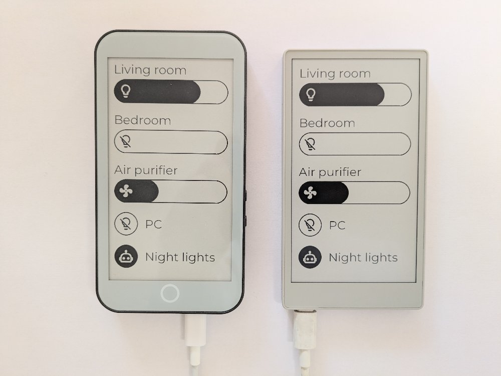

# Home Assistant ePaper remote

e-Ink remote for Home Assistant built with [FastEPD](https://github.com/bitbank2/FastEPD).



It uses the websocket API of Home Assistant, no plugin is required on the server.
As it stays permanently connected to the Wifi to get updates, the remote only lasts a few hours on battery.

## Hardware supported

- [Lilygo T5 E-Paper S3 Pro](https://lilygo.cc/products/t5-e-paper-s3-pro)
- [M5Stack M5Paper S3](https://docs.m5stack.com/en/core/PaperS3)

## Setup

You will need to install [PlatformIO](https://platformio.org/) to compile the project.

### Generate icons

Find the icons for your buttons at [Pictogrammers](https://pictogrammers.com/library/mdi/).
Use "Download PNG (256x256)" and place your icons in the `icons-buttons` folder.
Make sure you have an icon for the "on" state and one for the "off" state of each of your buttons.

Then run the python script `generate-icons.py` to generate the file `src/assets/icons.h`.
You will need to install the library [Pillow](https://pillow.readthedocs.io/en/stable/installation/basic-installation.html#basic-installation) to run this script.

### Get a home assistant token

In Home Assistant:

- Click on your username in the bottom left
- Go to "security"
- Click on "Create Token" in the "Long-lived access tokens" section
- Note the token generated

### Update configuration

Copy `src/config_remote.cpp.example` to `src/config_remote.cpp` then update the file accordingly.

## Notes

### Getting more logs

To get some logs from the serial port, uncomment the following line from `platformio.ini`:

```
    # -DCORE_DEBUG_LEVEL=5
```

### Updating the font

The font used is Montserrat Regular in size 26, it was converted using [fontconvert from FastEPD](https://github.com/bitbank2/FastEPD/tree/main/fontconvert):

```
./fontconvert Montserrat-Regular.ttf `src/assets/Montserrat_Regular_26.h` 26 32 126
```

## License

[This project is released under Apache License 2.0.](./LICENSE)

This repository contains resources from:

- https://github.com/Templarian/MaterialDesign (SIL OPEN FONT LICENSE Version 1.1)
- https://github.com/JulietaUla/Montserrat (Apache License 2.0)


