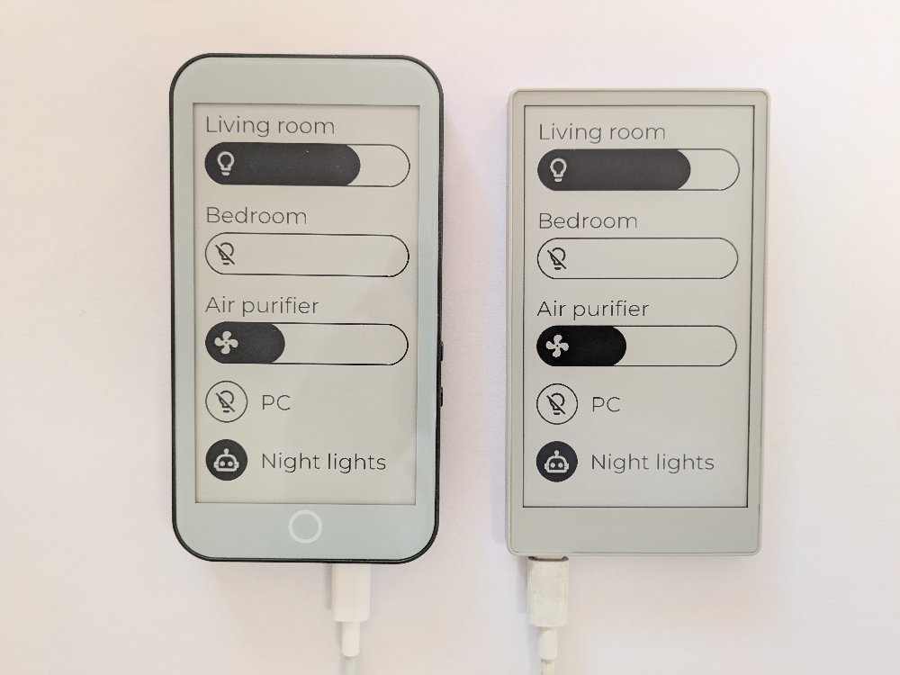
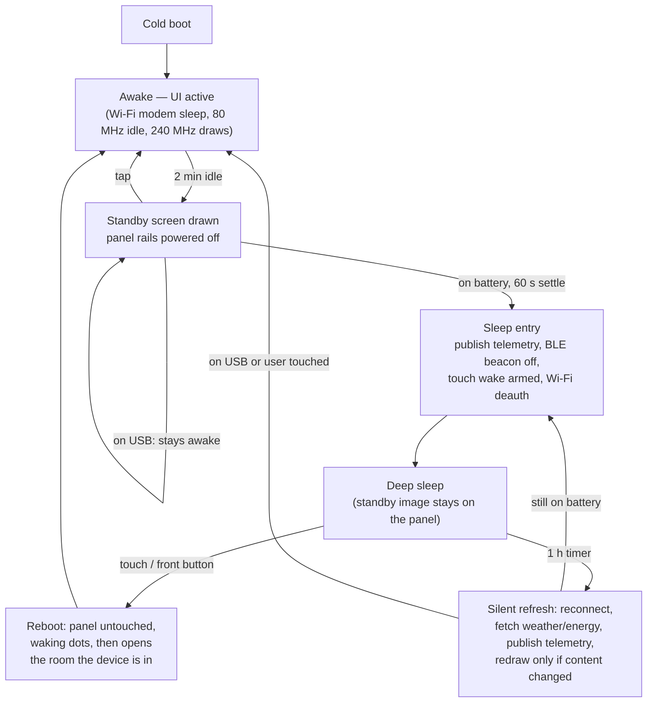

# Home Assistant ePaper remote

e-Ink remote for Home Assistant built with [FastEPD](https://github.com/bitbank2/FastEPD).



It uses the websocket API of Home Assistant, no plugin is required on the server.
While in use it stays connected to Wi-Fi for live updates; on battery it deep-sleeps
behind the standby screen (the e-ink keeps the image at no cost) and wakes on touch.

## Hardware supported

- [Lilygo T5 E-Paper S3 Pro](https://lilygo.cc/products/t5-e-paper-s3-pro)
- [M5Stack M5Paper S3](https://docs.m5stack.com/en/core/PaperS3)

## Setup

You will need to install [PlatformIO](https://platformio.org/) to compile the project.

### Generate icons

Find the icons for your buttons at [Pictogrammers](https://pictogrammers.com/library/mdi/).
Use "Download PNG (256x256)" and place your icons in the `icons-buttons` folder.
Make sure you have an icon for the "on" state and one for the "off" state of each of your buttons.

Then run the python script `generate-icons.py` to generate the file `src/assets/icons.h`.
You will need to install the library [Pillow](https://pillow.readthedocs.io/en/stable/installation/basic-installation.html#basic-installation) to run this script.

### Get a home assistant token

In Home Assistant:

- Click on your username in the bottom left
- Go to "security"
- Click on "Create Token" in the "Long-lived access tokens" section
- Note the token generated

### Update configuration

Copy `src/config_remote.cpp.example` to `src/config_remote.cpp` then update the file accordingly.

Optional standby data source fields are available in `Configuration`:

- `weather_entity_id`
- `energy_solar_entity_id`
- `energy_grid_entity_id`
- `energy_battery_usage_entity_id`
- `energy_battery_soc_entity_id`
- `energy_house_entity_id`

If these are omitted, firmware will still attempt to discover usable standby sources from Home Assistant (weather entity + energy preferences).

## Current UI and feature set

- Home Assistant-driven navigation:
  - Floors -> Rooms -> Room controls
  - Rooms without a floor are grouped under `Other Areas`
  - Floor/room lists are paged grids with horizontal swipe navigation
- Room controls:
  - Climate widgets (AC units only) are shown first and support `off/heat/cool` + `+/-0.5C`
  - Cover widgets support `Up/Open` and `Down/Close`
  - Light widgets are half-width tiles (2 per row) with dynamic sizing and room-page pagination
- Settings:
  - Home screen settings icon opens Settings menu
  - Wi-Fi settings page shows status, profile, SSID, IP, RSSI, scan results, and default-profile reset
  - On-screen Wi-Fi password entry for secure networks
  - Standby screen debug entry (`Standby Screen` tile)
- Standby mode:
  - Auto-activates after inactivity timeout
  - Tap anywhere returns to home
  - Displays weather forecast and daily energy summary
  - Refreshes on an hourly cadence while active
- Hardware home button:
  - Front button support on Lilygo T5 E-Paper S3 Pro (via touch controller key callback)
  - Returns to root home (floor list)

## Power management

The device runs three power regimes: awake (modem sleep + reduced CPU clock, full speed
during draws), standby (screen drawn, panel rails off), and battery-only deep sleep
(~µA, the e-ink keeps showing standby). Waking from deep sleep is a full reboot: the
old standby stays on the panel while booting, three dots acknowledge the touch, and the
device opens the room it is physically in (via Bermuda BLE presence).


```mermaid
flowchart TD
    Boot[Cold boot] --> Awake
    Awake["Awake — UI active<br/>(Wi-Fi modem sleep, 80 MHz idle, 240 MHz draws)"]
    Awake -->|2 min idle| Standby["Standby screen drawn<br/>panel rails powered off"]
    Standby -->|tap| Awake
    Standby -->|on USB: stays awake| Standby
    Standby -->|"on battery, 60 s settle"| Entry["Sleep entry<br/>publish telemetry, BLE beacon off,<br/>touch wake armed, Wi-Fi deauth"]
    Entry --> Sleep["Deep sleep<br/>(standby image stays on the panel)"]
    Sleep -->|touch / front button| Wake["Reboot: panel untouched,<br/>waking dots, then opens<br/>the room the device is in"]
    Wake --> Awake
    Sleep -->|1 h timer| Silent["Silent refresh: reconnect,<br/>fetch weather/energy, publish telemetry,<br/>redraw only if content changed"]
    Silent -->|still on battery| Entry
    Silent -->|on USB or user touched| Awake
```

Safety valves:

- Deep sleep only engages on battery (discharging per the fuel gauge); on USB the device
  behaves like an always-on remote and stays flashable/testable.
- A wake-boot streak counter in RTC memory disables sleeping if wake paths crash before
  proving healthy, so a bug can never boot-loop the device.
- Runtime kill switch: `standby sleep off` on the serial console or
  `POST /power {"standby_sleep": false}` on the test harness (the e2e suite does this
  automatically, since synthetic taps cannot wake sleeping hardware).
- A sleeping device is offline by design (no Wi-Fi, MQTT, BLE, or harness); its HA
  sensors keep their last values and expire after two missed hourly publishes. Wake it
  with a touch, the front button, or by plugging in USB and waiting for the next timer
  wake.

## Wi-Fi behavior notes

- If the startup/default Wi-Fi cannot be reached, firmware automatically opens Wi-Fi settings after a short timeout so another network can be selected.
- Wi-Fi scans run from the settings page and populate a paged network list.
- Custom Wi-Fi profile (SSID/password) is saved in NVS and can be reset to default from Wi-Fi settings.
- If upload fails with a busy serial port, close any active monitor process before flashing again.

## PlatformIO command quick reference

Run commands from the project root.

### Environments

- `lilygo-t5-s3` for Lilygo T5 E-Paper S3 Pro
- `m5-papers3` for M5Paper S3

### Common commands (Lilygo)

- Build only:

```bash
pio run -e lilygo-t5-s3
```

- Flash firmware:

```bash
pio run -e lilygo-t5-s3 -t upload
```

- Open serial monitor:

```bash
pio run -e lilygo-t5-s3 -t monitor
```

- Flash and then monitor in one command:

```bash
pio run -e lilygo-t5-s3 -t upload -t monitor
```

### Common commands (M5Paper)

- Build only:

```bash
pio run -e m5-papers3
```

- Flash firmware:

```bash
pio run -e m5-papers3 -t upload
```

- Serial monitor:

```bash
pio run -e m5-papers3 -t monitor
```

### Useful notes

- Exit monitor with `Ctrl+C`.
- If upload fails with a busy serial port, close monitor and run upload again.
- The Lilygo environment enables `esp32_exception_decoder` in monitor filters, so stack traces are decoded automatically.

## Testing

The firmware includes an HTTP test harness (port 8080, available once Wi-Fi is up) used by the e2e suite in `e2e/`:

- `GET /health`, `GET /state` — device status and UI state as JSON
- `POST /tap {"x":..,"y":..}`, `POST /swipe {"x1":..,"y1":..,"x2":..,"y2":..}`, `POST /home` — synthetic input
- `GET /screenshot` — raw framebuffer dump (decoded to PNG by the test client)

Run the tests with the device flashed and reachable (configuration via `.env`, see `e2e/config.py`):

```bash
uv run pytest -m "not slow"
```

Note the tests actuate the real Home Assistant entities configured in `.env`.

## Notes

### Continuous Integration

- GitHub Actions workflow: `.github/workflows/platformio-build.yml`
- Runs on push to `main`, pull requests, and manual dispatch
- Builds both PlatformIO environments:
  - `lilygo-t5-s3`
  - `m5-papers3`

### Getting more logs

To get some logs from the serial port, uncomment the following line from `platformio.ini`:

```
    # -DCORE_DEBUG_LEVEL=5
```

### Updating the font

The font used is Montserrat Regular in size 26, it was converted using [fontconvert from FastEPD](https://github.com/bitbank2/FastEPD/tree/main/fontconvert):

```
./fontconvert Montserrat-Regular.ttf `src/assets/Montserrat_Regular_26.h` 26 32 126
```

## License

[This project is released under Apache License 2.0.](./LICENSE)

This repository contains resources from:

- https://github.com/Templarian/MaterialDesign (SIL OPEN FONT LICENSE Version 1.1)
- https://github.com/JulietaUla/Montserrat (Apache License 2.0)
